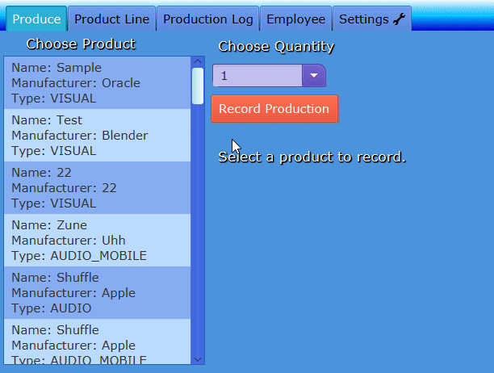

# Project Title
ProductionLineTracker

This program was created as a class project for the COP 3003 Object-Oriented Programming Class taught at FGCU. 

This project is a demonstration of understanding OOP concepts, front-end user experience ideas, and learning to make something progressively more awesome with each big patch.
I (Nicholas H) made this program by myself, with a lot of time spent on websites such as stack overflow, or other resources like the oracle Java site for references on how to use or what methods could be used in various scenarios. There was also some help given to me by my teacher Professor Vanselow and his TAs for certain bits of the code such as the setting up of the database.

I made this program over the course of my time at FGCU's COP 3003 Object-Oriented Programming class. I would say that after making this program I am at an above middling level of competence with working in Javafx and Scenebuilder.

Initially I made this project simply because I was assigned to, but over time I started to get more and more into making it an expression of my learning to demonstrate how willing I could be to learn something that interests me. Each time I got around to spending long sessions working on the project I set out to remix or improve upon what I had done before, so that each big push felt like it was something astounding, and worth being proud of. That being said I still believe there are more things I could do to polish and improve upon what exists in the most current version of this project.

## Demonstration

## Documentation
Java Documentation can be found at:
[This GitHub Pages Link](https://anagalacticruby.github.io/ProductionLineTracker/)

## Diagrams
(dbDiagrams.png)
(FinalClassDiagrams.png)
## Getting Started

If you want to run this program, make sure that you have the most recent version of java installed on your device. (In the near future a runnable jar file will be available for those who do not wish to download a full IDE to run this program)
If you do not wish to download the .jar file or cannot for whatever reason, then you will need to create a project for this program using an IDE such as NetBeans or Eclipse. You can then check out from version control inside of the IDE and or clone the repository from GitHub.

Then, you can run this program by accessing the main class and executing the main method (any of the two will do) within the class to start the program.

Upon booting up, the program will greet you(the user) with a tab pane featuring Five Tabs: Produce, Product Line, Production Log, Employee, and lastly Settings.
- In the Produce Tab, you are able to record the production of a product that is within the list featured on the left side of the screen. Then you are able to pick a quantity from the nearby dropdown, and the respective product you wish to record production of. The button will do all of the behind the scenes work for you, after you have selected a quantity and a product and press the button.
- In the Product Line tab, you are able to add more products to the table (And consequently the list on the previous tab) by filling out the two fields and selecting a type from the choice box on the upper left portion of the screen. A friendly progress bar and label will display how much progress you are at in the process of creating a new product for the program to remember. Note that it will not allow you to put in special characters. The button to add a product will only be usable once both text fields are full, and the item type has been chosen.
- In the Production Log tab, you will see a large text area which will display the record of a product previously requested to be recorded on the Produce tab.
- In the Employee tab, users can enter their full name and a password in order to generate details that would pertain to their hypothetical account for the program. Note that this is only saved locally, so you should write it down in the event you forget it for later.
- Within the Settings tab, a user can select one of three themes to apply to the entire program. Note that you cannot have multiple enabled at once, and the default is the light blue theme you should see upon starting the program up.

## Built With
IntelliJ IDEA 2019.2.1 Ultimate Edition
Resources used: 
[Java Css Reference Guide](https://docs.oracle.com/javase/9/docs/api/javafx/scene/doc-files/cssref.html)
[Java Regular Expression Article](https://www.vogella.com/tutorials/JavaRegularExpressions/article.html)
[How to enable multiple themes in a javafx program](https://stackoverflow.com/questions/49159286/make-a-dark-mode-with-javafx)
[The Modena Source Code](https://gist.github.com/maxd/63691840fc372f22f470)
## Contributing
Got a neat style sheet you would like to see in a future build? Make a separate branch and upload some that you would think are neat. Be sure to specify where they are located and what changes have been made somewhere in the commit messages.

## Author
Nicholas H.

## License

## Acknowledgments
My OOP Teacher, [Professor Vanselow](https://github.com/profvanselow)
And his TAs for COP 3003 2019
Various Students at FGCU

[Java Css Reference Guide](https://docs.oracle.com/javase/9/docs/api/javafx/scene/doc-files/cssref.html)
[Java Regular Expression Article](https://www.vogella.com/tutorials/JavaRegularExpressions/article.html)
[How to enable multiple themes in a javafx program](https://stackoverflow.com/questions/49159286/make-a-dark-mode-with-javafx)
[The Modena Source Code](https://gist.github.com/maxd/63691840fc372f22f470)

## History
Originally this program started out as a basic project assigned in a OOP class that I was taking but slowly evolved into much more as I learned more about the ins and outs of Javafx, Css, and Scenebuilder. It became a bigger and bolder expression of testing myself to see how much I could get done in the limited amount of time available in the course. Each time that I sat back down to code more on the project I tried to push myself to see what new feature or idea I could attempt to put in so that it became better than the previous big patch.
Notable Patches 
- Alpha: This had the basic root of the whole program, with (mostly) working tabs, fields, and a table that didn't populate itself. If there was any Css attached at this point, it was very minimal. Only three tabs were present - Produce, Product Line, and Production Log.
- Beta: This had what is now called the "RetroTheme.css" file attached to it, and had a lot of fancy css elements to show off how much I was willing to delve into the actual feeling of making this into a bigger project. This is where the progress bar, styling and disabling of certain buttons, and table were fleshed out. The table and listview worked in this iteration, and there was no way at the time to change the themes of the project. There was not much error handling put in at this stage.
- "Gamma" / Deliverable: This is the most recent iteration of the program, featuring a whopping THREE stylesheets to pick from, the new Settings and Employee tabs, and some more error handling. Around this time I had learned how to make regular expressions work, and those now are in place to make sure users cannot input invalid characters in places they shouldn't. Error messages also exist, the default stylesheet got updated, more documenation exists. The Employee tab takes inputs and displays details for the information put in the fields after a user presses the button. I had planned to see if I could throw in animations too for this phase, but that did not happen with the time I had left to get things polished off. There isn't TOTAL database functionality, but there is enough to get things working decently. Also the productionLog tab now properly has a leading zeroes function.
## Key Programming Concepts Utilized
Inheritance
Style - Documentation and programming writing ways, User feel and experience, Contrast of colors, Making sure nothing went unused
